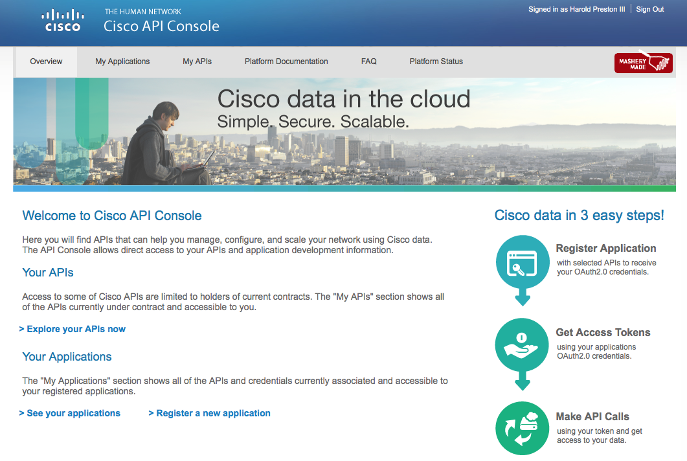
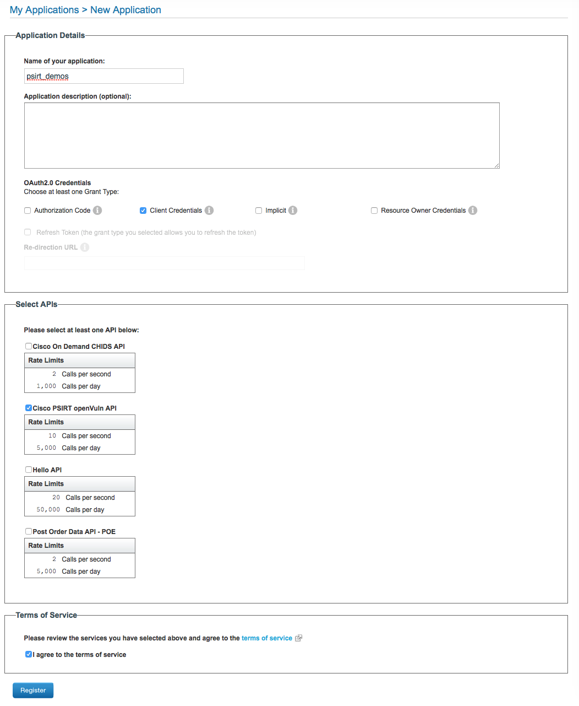
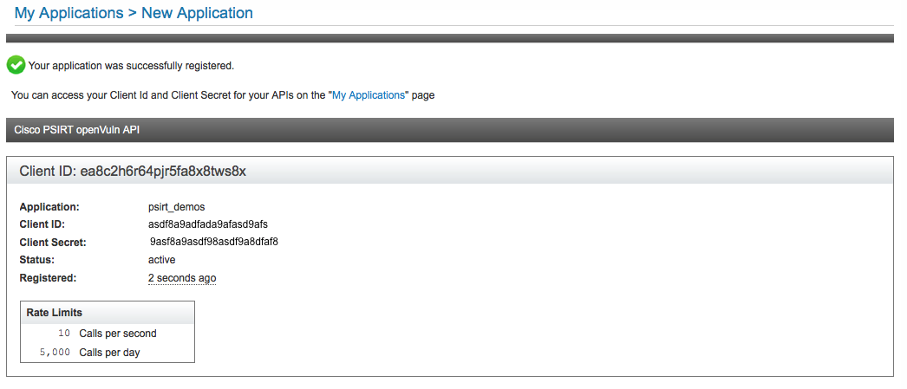

[Class Contents](../README.md) | [Module 7 Contents](Module 7 README.md) 

# Cisco PSIRT openVuln API

## Description of Product 

The Cisco Product Security Incident Response Team (PSIRT) openVuln API is a RESTful API that allows customers to obtain Cisco Security Vulnerability information in different machine-consumable formats.


## Type and Degree of Programmability 

RestAPI for accessing the data in multiple standard security formats.  

Uses OATH2 for authentication/authorization which means you need to register an "application" to get a "client_id" and "client_secret".  With this you can get a Token to use for API calls.  To register an application requires a CCO ID.  

## Where to find Development Docs 

* [DevNet](https://developer.cisco.com/site/PSIRT/)
* [GitHub](https://github.com/CiscoPSIRT/openVulnAPI)


## Example Code 

### One Time Step... register App

* Log into [https://apiconsole.cisco.com/](https://apiconsole.cisco.com/)

	

* Register your application
	* Client Credentials Type
	* Select the PSIRT API
	* Agree to Terms 

	
	
* Make note of the Client ID and Secret 

	

### This part uses the registered info... 

* Store your Client ID and Secret as Environment Variables 

```
# Fill in your details... 
export CLIENT_ID=XXXX
export CLIENT_SECRET=XXX
```

* Get a token that is good for one hour 

```
curl -s -k -X POST \
	-H "Content-Type: application/x-www-form-urlencoded" \
	-d "client_id=$CLIENT_ID" -d "client_secret=$CLIENT_SECRET" \
	-d "grant_type=client_credentials" \
	https://cloudsso.cisco.com/as/token.oauth2 

# data returned
{"access_token":"q3AOyasdfr7BQ2vczv7nVzWm9R13Bd","token_type":"Bearer","expires_in":3599}
```

* Create a variable with the token

```
# use the token you were given 
export API_TOKEN=XXX
```

* Send a request for the last 2 advisories 

```
curl -s -k -X GET \
	-H "Accept: application/json" \
	-H "Authorization: Bearer $API_TOKEN" \
	https://api.cisco.com/security/advisories/oval/latest/2 \
	| python -m json.tool

# Sample output 
{
    "advisories": [
        {
            "advisoryId": "cisco-sa-20160323-sip",
            "cves": [
                "CVE-2016-1350"
            ],
            "firstPublished": "2016-03-23T23:30:00+0000",
            "lastUpdated": "2016-05-09T17:46:51+0000",
            "oval": [
                "http://tools.cisco.com/security/center/contentxml/CiscoSecurityAdvisory/cisco-sa-20160323-sip/oval/cisco-sa-20160323-sip_564.xml"
            ],
            "sir": "High"
        },
        {
            "advisoryId": "cisco-sa-20160323-ios-ikev2",
            "cves": [
                "CVE-2016-1344"
            ],
            "firstPublished": "2016-03-23T21:00:00+0000",
            "lastUpdated": "2016-03-24T02:46:47+0000",
            "oval": [
                "http://tools.cisco.com/security/center/contentxml/CiscoSecurityAdvisory/cisco-sa-20160323-ios-ikev2/oval/cisco-sa-20160323-ios-ikev2_599.xml"
            ],
            "sir": "High"
        }
    ]
}

```